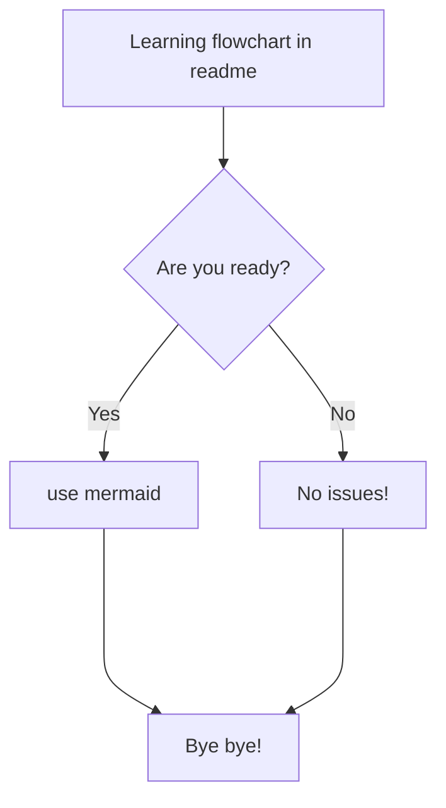

## NestJs Sample Project

```mermaid
flowchart TD
  A[Learning flowchart in readme] --> B{Are you ready?};
  B -- Yes --> C[use mermaid];
  B -- No --> D[No issues!];
  C ----> E[Bye bye!];
  D ----> E[Bye bye!];
```
